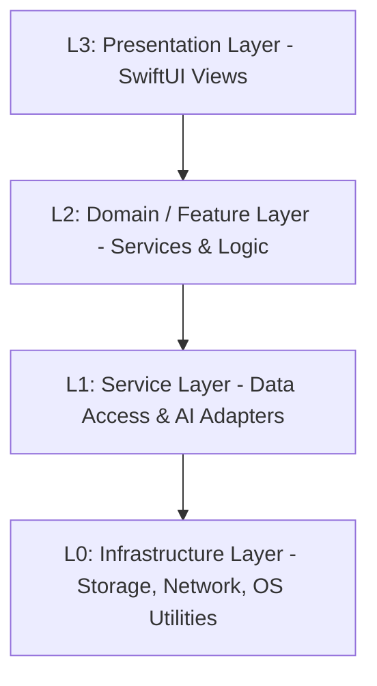

# 智元 (KM) 架构分层定义 (L0-L3)

本文档定义了“智元”系统的核心分层架构，旨在指导模块化重构、依赖管理和开发规范。

## 架构全景图 (Logical View)

---

## L0: Infrastructure Layer (基础设施层)
**职责**：提供与操作系统和第三方库的最底层交互。

**子目录** (`Sources/Shared/Services/`):
| 目录 | 内容 | 关键组件 |
| :--- | :--- | :--- |
| `Infrastructure/` | 系统级工具与平台桥接 | `LogService`, `SecurityManager`, `HapticManager`, `SpotlightService`, `DeepLinkService`, `PencilManager`, `AccessibilityService`, `OnboardingService`, `DataExportService`, `LocalAnalyticsService`, `PerformanceService`, `WorkflowService`, `WatchConnectivityService`, `SnapshotService`, `ShortcutManager`, `WebViewExportService` |
| `Storage/` | 物理存储引擎 | `SQLiteStore`, `KMStore`, `VaultService`, `VaultSecurityService`, `BackupService`, `SQLiteMigrator` |

## L1: Service Layer (基础服务层)
**职责**：对底层技术进行原子化抽象，提供跨业务的通用能力。

**子目录**:
| 目录 | 内容 | 关键组件 |
| :--- | :--- | :--- |
| `Logic/` | 纯业务逻辑与算法 | `LinkService`, `KnowledgeInsightService`, `RecursiveChunker` |
| `Processors/` | 文档解析与媒体处理 | `MarkdownParser`, `LinkScraperService`, `OCRService`, `PDFService`, `SpeechService` |
| `Plugins/` | 插件协议与注册中心 | `PluginProtocols`, `PluginRegistry`, `PluginMarketService` |
| `Sync/` | 多端同步引擎 | `iCloudSyncManager`, `KMiCloudSyncService`, `FileSystemSyncService` |
| `Graph/` | 图谱布局与聚类 | `GraphLayoutEngine`, `GraphClusteringService` |

## L2: Domain / Feature Layer (业务领域层)
**职责**：封装核心业务逻辑，实现复杂的功能闭环。

**子目录**:
| 目录 | 内容 | 关键组件 |
| :--- | :--- | :--- |
| `AI/` | 大模型通信与推理 | `LLMService`, `LLMClient`, `AISynthesisService`, `EmbeddingManager`, `IngestQueue`, `OnDeviceLLMService`, `PromptService` |
| `Feature/` | 高级功能编排 | `IngestService`, `CollaborationService`, `LintService`, `TaskCenter`, `UndoService` |
| `Gamification/` | 用户激励系统 | `MedalService` |
| `System/` | 系统级事件与调度 | `ActivityService`, `WikiEventBus` |

## L3: Presentation Layer (表现层)
**职责**：响应用户交互，展示状态，驱动导航。

**子目录** (`Sources/Shared/Views/`):
| 目录 | 内容 |
| :--- | :--- |
| `Core/` | 主框架：`ContentView`, `NavigationView`, `SidebarView`, `DashboardView`, `SearchView` |
| `Pages/` | 业务页面：页面列表、详情、历史版本 |
| `Editors/` | Markdown 编辑器与源码模式 |
| `Features/` | 高级功能视图：`GraphView`, `Graph3DView`, AI 合成视图 |
| `Components/` | 原子化可复用 UI 组件 |
| `CommandPalette/` | `Cmd+K` 全局指令面板 |
| `Settings/` | 设置相关视图 |

---

## 核心开发准则
1.  **单向依赖**：上层可以依赖下层，下层严禁依赖上层。跨层调用需通过协议 (Protocols) 解耦。
2.  **DI (依赖注入)**：使用 `@Inject` 模式在 L2/L3 层注入 L1 服务，方便进行 Mock 测试。
3.  **Actor 隔离**：L1/L2 服务原则上应标记为 `@MainActor` 或 `actor`，以符合 Swift 6 严格并发要求。
