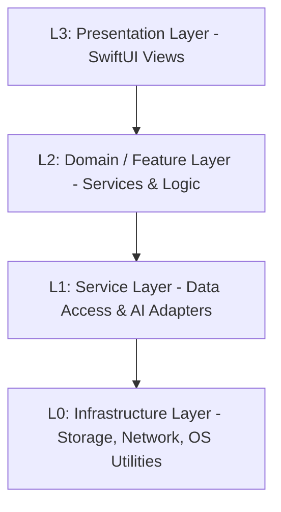

# 智元 (KM) 架构分层定义 (L0-L3)

本文档定义了“智元”系统的核心分层架构，旨在指导模块化重构、依赖管理和开发规范。

## 架构全景图 (Logical View)

---

## L0: Infrastructure Layer (基础设施层)
**职责**：提供与操作系统和第三方库的最底层交互。
- **CoreData / SQLite (GRDB)**：物理存储引擎。
- **Networking**：基础 URLSession 封装。
- **Security Utilities**：Keychain 访问、生物识别 (LocalAuthentication) 底层封装。
- **Logger**：全库统一日志服务。

## L1: Service Layer (基础服务层)
**职责**：对底层技术进行原子化抽象，提供跨业务的通用能力。
- **KMStore (Persistence)**：负责 WikiPage 的 CRUD 原子操作。
- **LLMClient**：负责 OpenAI 兼容协议的 HTTP 通信。
- **EmbeddingManager**：负责文本到向量的转换逻辑。
- **LinkScraper**：负责 HTML/Markdown 的基础爬取与解析。

## L2: Domain / Feature Layer (业务领域层)
**职责**：封装核心业务逻辑，实现复杂的功能闭环。
- **LinkScraperService**：处理网页抓取、YouTube 解析及 Markdown 转换的业务流。
- **KnowledgeInsightService**：执行复杂的 RAG 查询、生成每日闪念与周报。
- **AISynthesisService**：处理思维导图生成、知识测验、摘要提取等 AI 实验室功能。
- **IngestService**：负责数据导入的完整生命周期（下载 -> 预处理 -> 存储 -> 索引）。

## L3: Presentation Layer (表现层)
**职责**：响应用户交互，展示状态，驱动导航。
- **SwiftUI Views**：Dashboard, Search, PageDetail 等视图组件。
- **ViewModels (Observable)**：负责视图状态管理（逐步迁移至 @Observable）。
- **NavigationCenter**：负责跨 Tab 和深层链接的导航调度。

---

## 核心开发准则
1.  **单向依赖**：上层可以依赖下层，下层严禁依赖上层。跨层调用需通过协议 (Protocols) 解耦。
2.  **DI (依赖注入)**：使用 `@Inject` 模式在 L2/L3 层注入 L1 服务，方便进行 Mock 测试。
3.  **Actor 隔离**：L1/L2 服务原则上应标记为 `@MainActor` 或 `actor`，以符合 Swift 6 严格并发要求。
