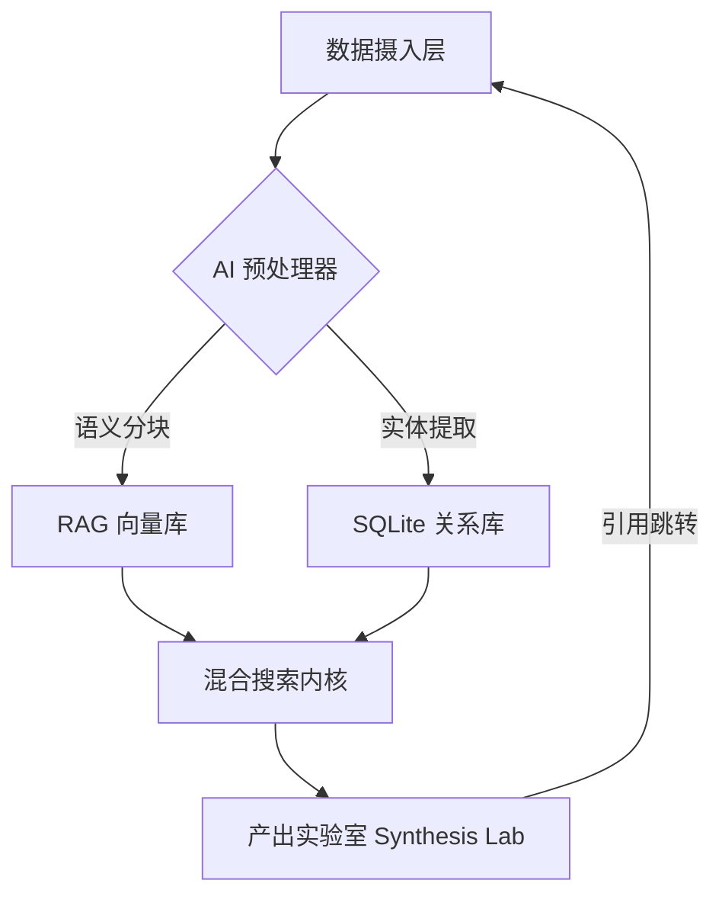
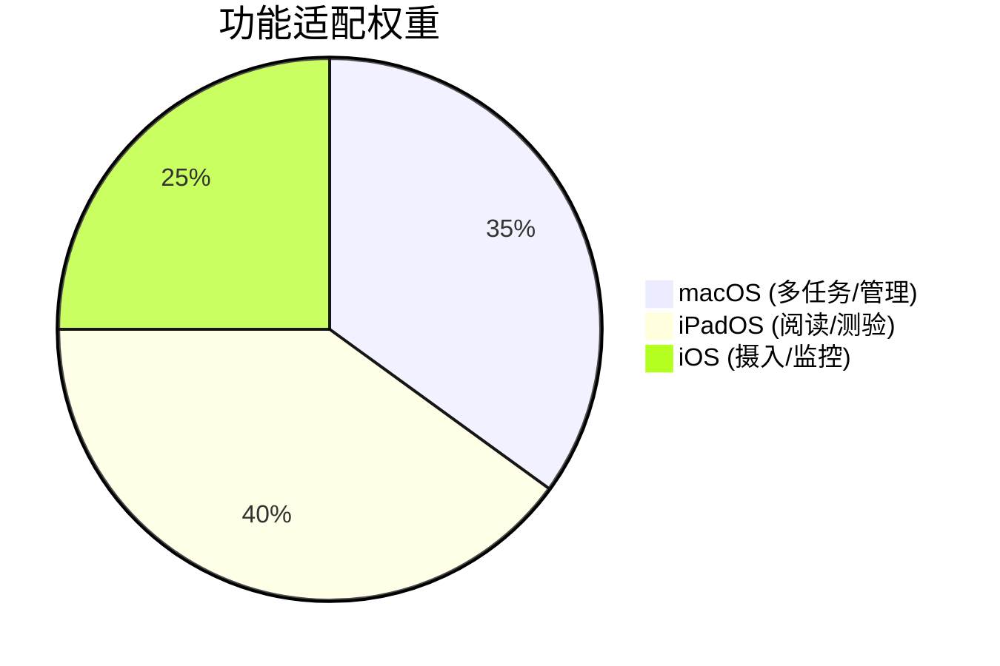

# WorkBuddy (KnowledgeBase)

> **"Build a personal library of concepts, entities, and sources."**
> 基于 Karpathy LLM Wiki 方法论的 AI 原生知识管理进化引擎。

---

## 📚 深度文档 (Documentation)

- [📖 用户操作指南 (User Guide)](file:///Users/constantine/Documents/work/code/projects/workbuddy/KnowledgeBase/docs/USER_GUIDE.md) - 从新手到专家的全量实战手册。
- [🏗️ 架构设计文档 (Architecture)](file:///Users/constantine/Documents/work/code/projects/workbuddy/KnowledgeBase/docs/ARCHITECTURE.md) - 深入解析 4+1 架构视图与 RAG 实现细节。

---

## 🏗️ 架构全景：知识编译生态 (Knowledge Compiler Ecosystem)

WorkBuddy 不仅是 Markdown 编辑器，它是一个 **AI 原生 RAG 闭环系统**。

### 1. 核心架构图谱

### 2. 三层技术模型

#### 🟢 深度摄入层 (Ingestion Layer)
- **语义分块 (Semantic Chunking)**：基于 `RecursiveChunker` 的递归拆分算法。
- **分块优先级**：`Header (#) > Paragraph (\n\n) > Sentence (.)`，确保检索片段的上下文连续性。
- **多模态解析**：自动将 PDF 中的表格转化为可索引的 JSON 描述。

#### 🔵 混合存储层 (Storage & Hybrid RAG)
- **FTS5 + Vector**：结合全文搜索的“刚性匹配”与向量距离的“柔性关联”。
- **Security-Scoped Bookmarks**：攻克 iOS/iPadOS 沙盒权限持久化难题，实现外部 Vault 挂载。

#### 🟣 产出实验室 (Synthesis Lab)
- **AI 联动交互**：基于 NotebookLM 逻辑，支持生成思维导图、JSON 测验、深度总结。
- **Deep Citation**：在 AI 产出中使用 `[[Source]]` 实现语义溯源。

---

## 🌟 核心特性矩阵

| 特性 | 描述 | 技术实现 |
|------|------|---------|
| **语义溯源** | 点击引用标记瞬间定位原文 | Markdown 正则解析 + 文本高亮锚点 |
| **产出实验室** | 知识转化为测验、导图、报告 | 结构化 Prompt + JSON Schema 校验 |
| **外部库同步** | 挂载本地 Obsidian 或物理目录 | Scoped URL + VaultService 增量扫描 |
| **AI 任务中控** | 全局监控后台长耗时 AI 任务 | AITaskCenter + Combine 状态流 |
| **物理快照** | 版本回滚与知识重构防护 | SnapshotService + 内容 Hash 校验 |

---

## 📱 跨平台适配细节 (Cross-Platform Parity)

- **iPhone**：顶部的 **AI 脉搏灯** 提供非侵入式进度反馈；Quiz 采用全屏模态。
- **iPad**：支持 Split View 与 Slide Over，Quiz 在平板模式下提供大尺寸交互窗口。
- **macOS**：支持三栏式 SplitView，侧边栏 Badge 实时显示后台 AI 任务堆栈。

---

## 📖 操作指南

### 1. RAG 知识导入
拖入 PDF 或粘贴 URL，系统会自动执行 **“深度扫描”**。
> **Tip**: 在 `RecursiveChunker.swift` 中可以调整分块大小（默认 800 字符）。

### 2. 交互式溯源
在 AI 生成的报告中点击 `[[Source]]`：
1. 系统会通过 **HapticManager** 提供触感反馈。
2. 原文编辑器会自动滚动并高亮该出处。

### 3. 外部库挂载
点击侧边栏 **“挂载外部库”**，授权访问物理文件夹。WorkBuddy 将作为这些 Markdown 文件的“AI 增强层”。

---

## 🛠️ 技术栈选型

- **UI**: SwiftUI (iOS 17+ / macOS 14+)
- **DB**: SQLite3 + FTS5 + Vector Extension
- **NLP**: NaturalLanguage.framework + Accelerate (vDSP)
- **Auth**: Security-Scoped Bookmarks (iOS Persistence)
- **AI**: DeepSeek-V3 / GPT-4o / Claude 3.5

---

## 🚀 快速开始

1. **环境**：Xcode 15+ & `brew install xcodegen`。
2. **构建**：运行 `xcodegen generate`。
3. **配置**：在设置中填入 API Key，并开启 **“深度扫描模式”**。

---

> *"人类的工作是策展来源、引导分析、问好问题。大模型的工作是除此之外的一切。"*  
> — Andrej Karpathy
