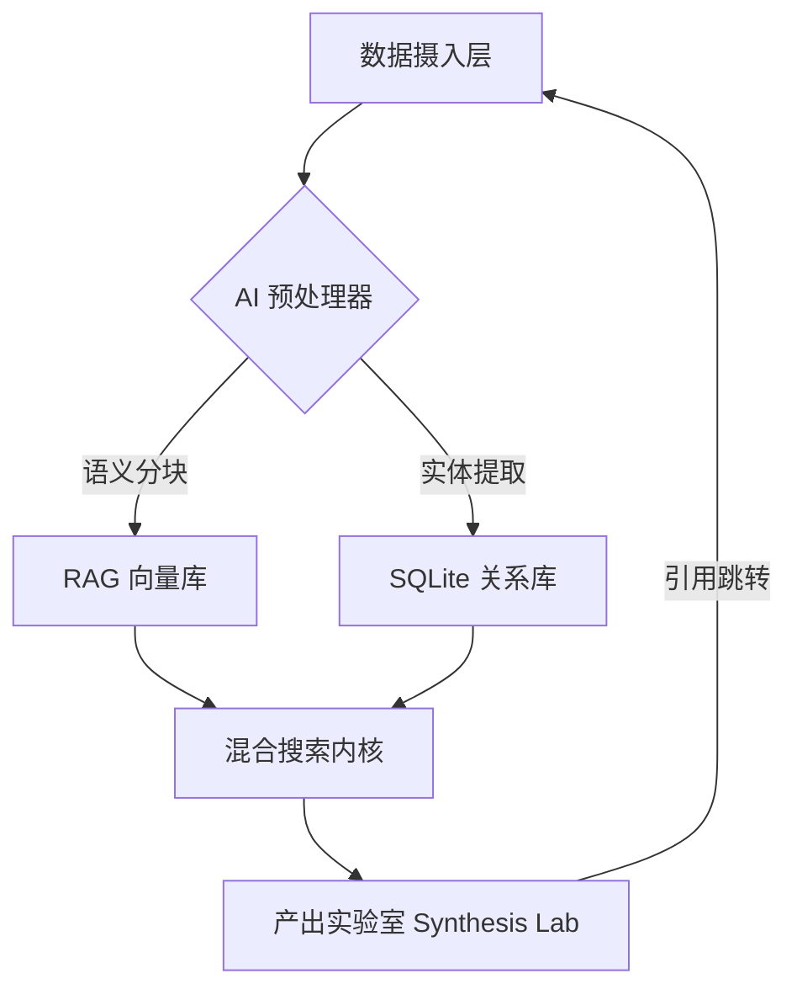

# Knowledge Management (KnowledgeBase)

> **"Build a personal library of concepts, entities, and sources."**
> 基于 Karpathy LLM Wiki 方法论的 AI 原生知识管理进化引擎。

---

## 📚 深度文档 (Documentation)

- [📖 产品规格说明书 (Specifications)](file:///Users/constantine/Documents/work/code/projects/knowledge-management/KnowledgeBase/docs/SPECIFICATIONS.md) - PRD、SRS 与核心特性规格。
- [🏗️ 架构设计文档 (Architecture)](file:///Users/constantine/Documents/work/code/projects/knowledge-management/KnowledgeBase/docs/ARCHITECTURE.md) - 4+1 视图、L0-L3 分层及 **详细设计**。
- [🎨 视觉设计系统 (Design System)](file:///Users/constantine/Documents/work/code/projects/knowledge-management/KnowledgeBase/docs/DESIGN_SYSTEM.md) - 色彩、字体与交互反馈规范。
- [🚨 异常处理规范 (Error Handling)](file:///Users/constantine/Documents/work/code/projects/knowledge-management/KnowledgeBase/docs/ERROR_HANDLING.md) - 全系统错误码与 UI 映射准则。
- [🤝 贡献指南 (Contributing)](file:///Users/constantine/Documents/work/code/projects/knowledge-management/KnowledgeBase/docs/CONTRIBUTING.md) - 工程规范、Git 流与代码标准。
- [🚀 进化路线图 (Roadmap)](file:///Users/constantine/Documents/work/code/projects/knowledge-management/KnowledgeBase/docs/FUTURE_ROADMAP.md) - 短、中、远期的产品演进与前瞻技术规划。
- [📖 用户操作指南 (User Guide)](file:///Users/constantine/Documents/work/code/projects/knowledge-management/KnowledgeBase/docs/USER_GUIDE.md) - 从新手到专家的全量实战手册。

---

## 🏗️ 架构全景：知识编译生态 (Knowledge Compiler Ecosystem)

Knowledge Management 不仅是 Markdown 编辑器，它是一个 **AI 原生 RAG 闭环系统**。

### 1. 核心架构图谱

### 2. 三层技术模型

#### 🟢 深度摄入层 (Ingestion Layer)
- **语义分块 (Semantic Chunking)**：基于 `RecursiveChunker` 的递归拆分算法。
- **分块优先级**：`Header (#) > Paragraph (\n\n) > Sentence (.)`，确保检索片段的上下文连续性。
- **多模态解析**：自动将 PDF 中的表格转化为可索引的 JSON 描述。

#### 🔵 混合存储层 (Storage & Hybrid RAG)
- **FTS5 + Vector**：结合全文搜索的“刚性匹配”与向量距离的“柔性关联”。
- **Security-Scoped Bookmarks**：攻克 iOS/iPadOS 沙盒权限持久化难题，实现外部 Vault 挂载。

#### 🟣 产出实验室 (Synthesis Lab)
- **AI 联动交互**：基于 NotebookLM 逻辑，支持生成思维导图、JSON 测验、深度总结。
- **Deep Citation**：在 AI 产出中使用 `[[Source]]` 实现语义溯源。

---

## 🌟 核心特性矩阵

| 特性 | 描述 | 技术实现 |
|------|------|---------|
| **响应式架构** | iPad/Mac 自动进化为三栏式桌面布局 | NavigationSplitView + SizeClass 适配 |
| **指令中枢** | 全局 Cmd+K 唤起搜索与高频指令 | KeyboardShortcut + 模糊检索模型 |
| **空间面包屑** | 历史路径回溯，解决深度跳转迷失感 | NavigationHistory + 物理级 UI 组件 |
| **感知透明化** | AI 实时思维日志展示 | AITaskCenter + 动态日志流渲染 |
| **语义溯源** | 知识芯片化跳转，点击瞬间定位原文 | Markdown 解析 + 互动 Chip 组件 |

---

## 📱 跨平台适配细节 (Adaptive Design)

Knowledge Management 采用一套代码实现多端差异化交互：

- **iPhone**: 经典的 `TabView` 底栏导航，单手操作友好。
- **iPad**: 自动切换为 **三栏式 SplitView**。左侧模块导航，中间页面列表，右侧沉浸式详情。
- **macOS**: 完美的桌面软件体验。支持 `Cmd + K` 全局唤起，配合多窗口模式实现极致生产力。

---

## 📖 操作指南

### 1. RAG 知识导入
拖入 PDF 或粘贴 URL，系统会自动执行 **“深度扫描”**。
> **Tip**: 在 `RecursiveChunker.swift` 中可以调整分块大小（默认 800 字符）。

### 2. 交互式溯源
在 AI 生成的报告中点击 `[[Source]]`：
1. 系统会通过 **HapticManager** 提供触感反馈。
2. 原文编辑器会自动滚动并高亮该出处。

### 3. 外部库挂载
点击侧边栏 **“挂载外部库”**，授权访问物理文件夹。Knowledge Management 将作为这些 Markdown 文件的“AI 增强层”。

---

## 🛠️ 技术栈选型

- **UI**: SwiftUI (iOS 17+ / macOS 14+)
- **DB**: SQLite3 + FTS5 + Vector Extension
- **NLP**: NaturalLanguage.framework + Accelerate (vDSP)
- **Auth**: Security-Scoped Bookmarks (iOS Persistence)
- **AI**: DeepSeek-V3 / GPT-4o / Claude 3.5

---

## 🚀 快速开始

1. **环境**：Xcode 15+ & `brew install xcodegen`。
2. **构建**：运行 `xcodegen generate`。
3. **配置**：在设置中填入 API Key，并开启 **“深度扫描模式”**。

---

> *"人类的工作是策展来源、引导分析、问好问题。大模型的工作是除此之外的一切。"*  
> — Andrej Karpathy
