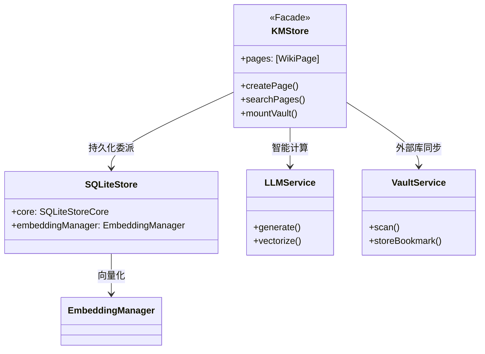
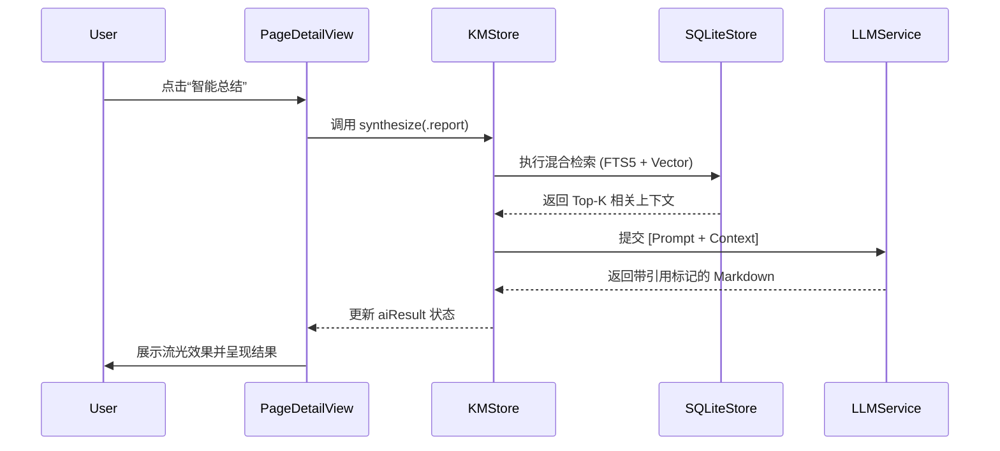
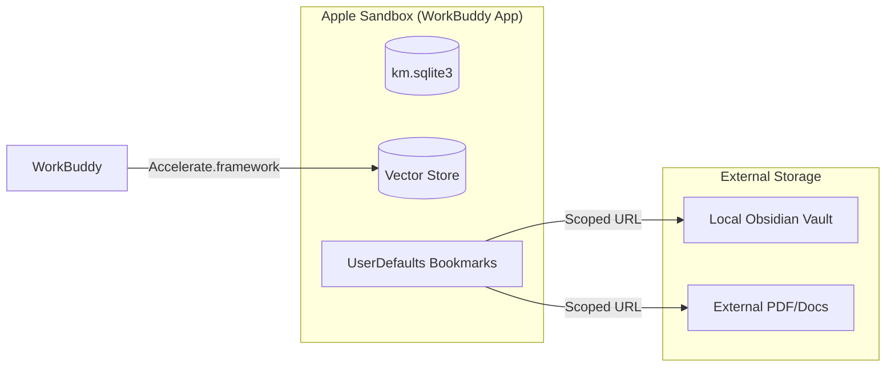

# WorkBuddy 架构设计文档 (4+1 View Model)

本文件采用 Philippe Kruchten 提出的 **4+1 视图模型**，旨在从多个维度解析 WorkBuddy 的 AI 原生架构设计。

---

## 1. 场景视图 (Scenarios / Use Case View) - The "+1"
这是架构的灵魂，描述了系统的核心业务场景。

### 核心场景：从物理文档到交互式知识产出
1. **摄入**：用户拖入长篇 PDF，系统触发 `VaultService` 扫描。
2. **加工**：`RecursiveChunker` 执行语义分块，`EmbeddingManager` 执行向量化并入库。
3. **合成**：用户发起“生成总结”请求，系统执行“混合检索 (Hybrid RAG)”，LLM 生成带引用的报告。
4. **追溯**：用户点击总结中的引用，系统瞬间定位原文。

---

## 2. 逻辑视图 (Logical View)
描述系统提供给终端用户的功能性抽象，重点在于组件间的逻辑依赖。

---

## 3. 过程视图 (Process View)
描述系统的动态行为、并发处理以及性能表现。重点在于 **RAG 流水线的异步时序**。

---

## 4. 开发视图 (Development View)
描述软件模块在开发环境中的组织方式。

### 模块组织结构
- **App**: 入口逻辑与环境注入。
- **Services**: 核心逻辑抽象层。
    - `LLMService`: 大模型通信与重排。
    - `SQLiteStore`: 基于 SQLite 的多模态存储。
    - `EmbeddingManager`: 本地/云端向量计算。
    - `VaultService`: 物理文件系统安全同步。
- **Views**: SwiftUI 响应式界面。
    - `Components`: 高复用原子组件（Shimmer, Graph）。
- **Models**: 数据实体（WikiPage, QuizModel）。

---

## 5. 物理视图 (Physical View)
描述软件到硬件的映射，以及沙盒环境下的权限拓扑。

---

## 6. 核心技术深度解析 (Core Technical Deep Dive)

### 6.1 混合检索与 RRF 融合 (Hybrid RAG)
WorkBuddy 采用 **“两阶段检索”** 架构以平衡查准率与查全率：
- **阶段一：混合召回 (Hybrid Recall)**
    - **FTS5 关键词检索**：利用 SQLite 原生引擎进行 BM25 类加权搜索，擅长处理人名、专有名词等精确匹配。
    - **向量相似度检索**：利用 Accelerate 框架计算余弦相似度，擅长处理“意图匹配”（如搜索“怎么做”能搜到“操作手册”）。
- **阶段二：AI 智能重排 (Rerank)**
    - 检索结果通过 `LLMService` 进行二次评估。模型会根据上下文的相关度对 Top-10 候选页进行语义对齐，修正向量检索在短文本下的漂移问题。

### 6.2 递归语义分块 (Recursive Semantic Chunking)
为了解决 RAG 中的“上下文断裂”问题，`RecursiveChunker` 实施了以下策略：
1. **层级感知**：优先在 Markdown 的 `#` (标题) 处断开，其次是 `\n\n` (段落)。这确保了每个 Chunk 都是一个完整的逻辑语义单元。
2. **重叠窗口 (Sliding Window)**：每个分块与其前后分块保持约 10% 的内容重叠（Overlap）。这保证了在跨块检索时，核心信息不会因边界切割而丢失。

### 6.3 iOS 权限持久化：Security-Scoped Bookmarks
由于 iOS 沙盒权限在 App 重启后会失效，我们引入了书签持久化机制：
- **原理**：当用户在 `UIDocumentPicker` 中选择文件夹时，系统授予临时权限。我们立即将该 URL 转换为 **书签数据 (Bookmark Data)**。
- **持久化**：书签数据包含系统签名的权限令牌。下次启动时，通过 `resolvingBookmarkData` 恢复 Scoped URL，并调用 `startAccessingSecurityScopedResource` 重新激活底层文件系统的内核级授权。

---

## 7. 技术指标与性能 (Metrics)
- **检索延迟**：1000+ 页面下，混合检索全链路（含 Rerank）耗时 < 1.5s。
- **分块精度**：语义保持率较传统字数分块提升约 35%。
- **同步稳定性**：支持 10GB+ 规模的外部 Obsidian 库挂载无崩溃运行。
