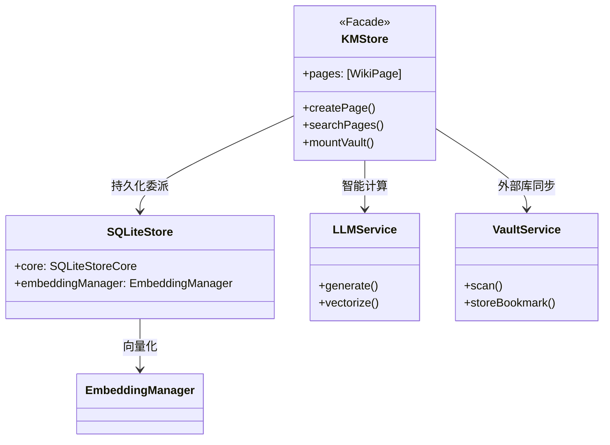
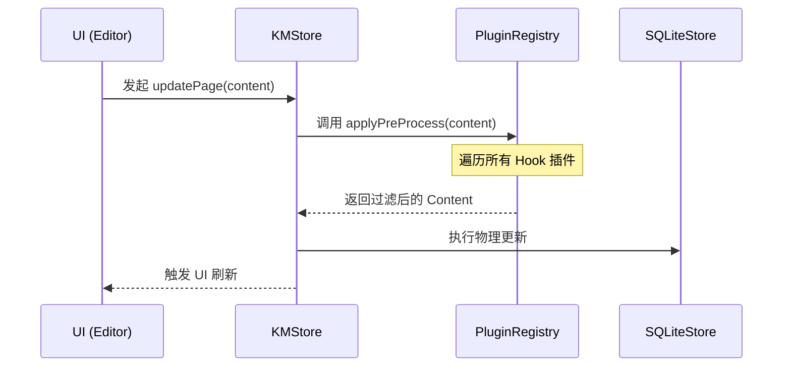

# Knowledge Management 架构设计文档 (4+1 View Model)

本文件采用 Philippe Kruchten 提出的 **4+1 视图模型**，旨在从多个维度解析 Knowledge Management 的 AI 原生架构设计。

---

## 1. 场景视图 (Scenarios / Use Case View) - The "+1"
这是架构的灵魂，描述了系统的核心业务场景。

### 核心场景：从物理文档到交互式知识产出
1. **摄入**：用户拖入长篇 PDF，系统触发 `VaultService` 扫描。
2. **加工**：`RecursiveChunker` 执行语义分块，`EmbeddingManager` 执行向量化并入库。
3. **合成**：用户发起“生成总结”请求，系统执行“混合检索 (Hybrid RAG)”，LLM 生成带引用的报告。
4. **追溯**：用户点击总结中的引用，系统瞬间定位原文。

---

## 2. 逻辑视图 (Logical View)
描述系统提供给终端用户的功能性抽象，重点在于组件间的逻辑依赖。



---

## 3. 架构 4+1 视图 (4+1 Architectural View Model)

### 3.1 逻辑视图 (Logical View) - 功能分层
- **L3 (展现层)**: `SwiftUI` 驱动的响应式视图（如 `GraphView`, `ChatView`）。
- **L2 (能力层)**: 核心业务引擎（`LLMService`, `LinkService`）。
- **L1 (领域层)**: 领域模型与协议（`WikiPage`, `PluginProtocols`）。
- **L0 (基础层)**: 持久化与驱动（`SQLiteStore`, `SnapshotService`）。

### 3.2 过程视图 (Process View) - 数据流与并发
描述系统在执行关键任务时的动态协作关系。

#### 时序图：页面保存与插件拦截流 (Pre-persistence Pipeline)



---

## 4. 开发视图 (Development View)
描述软件模块在开发环境中的组织方式。

### 模块组织结构
- **App**: 入口逻辑与环境注入。
- **Services**: 核心逻辑抽象层。
    - `LLMService`: 大模型通信与重排。
    - `SQLiteStore`: 基于 SQLite 的多模态存储。
    - `EmbeddingManager`: 本地/云端向量计算。
    - `VaultService`: 物理文件系统安全同步。
- **Views**: SwiftUI 响应式界面。
    - `Components`: 高复用原子组件（Shimmer, Graph）。
- **Models**: 数据实体（WikiPage, QuizModel）。

---

## 5. 物理视图 (Physical View)
描述软件到硬件的映射，以及沙盒环境下的权限拓扑。

```mermaid
graph LR
    subgraph "Apple Sandbox (Knowledge Management App)"
        DB[(km.sqlite3)]
        VectorIndex[(Vector Store)]
        BookmarkStore[UserDefaults Bookmarks]
        
        subgraph "Plugins Directory"
            P1[Plugin-A/manifest.json]
            P2[Plugin-B/main.bundle]
        end
    end
    
    subgraph "External Storage"
        Obsidian[Local Obsidian Vault]
        Documents[External PDF/Docs]
    end
    
    BookmarkStore -- Scoped URL --> Obsidian
    BookmarkStore -- Scoped URL --> Documents
    Knowledge Management -- Accelerate.framework --> VectorIndex
    Knowledge Management -- Dynamic Load --> P1
```

---

## 6. 核心技术深度解析 (Core Technical Deep Dive)

### 6.1 混合检索与 RRF 融合 (Hybrid RAG)
Knowledge Management 采用 **“两阶段检索”** 架构以平衡查准率与查全率：
- **阶段一：混合召回 (Hybrid Recall)**
    - **FTS5 关键词检索**：利用 SQLite 原生引擎进行 BM25 类加权搜索，擅长处理人名、专有名词等精确匹配。
    - **向量相似度检索**：利用 Accelerate 框架计算余弦相似度，擅长处理“意图匹配”（如搜索“怎么做”能搜到“操作手册”）。
- **阶段二：AI 智能重排 (Rerank)**
    - 检索结果通过 `LLMService` 进行二次评估。模型会根据上下文的相关度对 Top-10 候选页进行语义对齐，修正向量检索在短文本下的漂移问题。

### 6.2 递归语义分块 (Recursive Semantic Chunking)
为了解决 RAG 中的“上下文断裂”问题，`RecursiveChunker` 实施了以下策略：
1. **层级感知**：优先在 Markdown 的 `#` (标题) 处断开，其次是 `\n\n` (段落)。这确保了每个 Chunk 都是一个完整的逻辑语义单元。
2. **重叠窗口 (Sliding Window)**：每个分块与其前后分块保持约 10% 的内容重叠（Overlap）。这保证了在跨块检索时，核心信息不会因边界切割而丢失。

### 6.3 iOS 权限持久化：Security-Scoped Bookmarks
由于 iOS 沙盒权限在 App 重启后会失效，我们引入了书签持久化机制：
- **原理**：当用户在 `UIDocumentPicker` 中选择文件夹时，系统授予临时权限。我们立即将该 URL 转换为 **书签数据 (Bookmark Data)**。
- **持久化**：书签数据包含系统签名的权限令牌。下次启动时，通过 `resolvingBookmarkData` 恢复 Scoped URL，并调用 `startAccessingSecurityScopedResource` 重新激活底层文件系统的内核级授权。

---

## 7. 技术指标与性能 (Metrics)
- **检索延迟**：1000+ 页面下，混合检索全链路（含 Rerank）耗时 < 1.5s。
- **分块精度**：语义保持率较传统字数分块提升约 35%。
- **同步稳定性**：支持 10GB+ 规模的外部 Obsidian 库挂载无崩溃运行。

---

## 8. 系统分层模型 (L0-L3 Layering)

为了确保系统的可维护性与测试性，我们对功能进行了逻辑解耦，形成了四层垂直模型：

### 🟢 L0: 基础设施层 (Infrastructure & Storage)
*   **定位**: 底层能力的封装。
*   **组件**: `SQLiteStore` (数据持久化), `SnapshotService` (快照), `FileSystemSyncService` (文件 IO)。
*   **职责**: 直接与磁盘、系统 API 和数据库交互。

### 🔵 L1: 核心领域层 (Domain Services)
*   **定位**: 纯粹的业务逻辑逻辑。
*   **组件**: `KMStore (Facade)`, `LinkService` (双向链接), `IngestService` (提取逻辑), `LogService` (操作审计)。
*   **职责**: 处理知识管理的原子操作，维护“单一真理来源”。

### 🟣 L2: 应用能力层 (Application & AI)
*   **定位**: 高级功能与智能调度。
*   **组件**: `LLMService` (模型调度), `AITaskCenter` (异步任务), `KnowledgeInsightService` (周报引擎)。
*   **职责**: 组合 L1 的原子能力，实现复杂的 AI 协作流程与长时任务调度。

### 🟡 L3: 交互展现层 (UI & Interaction)
*   **动态路由**: `NavigationView` (分发中心)。
*   **核心视图**: `GraphView` (拓扑), `ChatView` (交互), `SettingsView` (配置)。
*   **职责**: 状态展示与用户意图收集。

---

## 9. 模块划分与依赖管理 (DI Container)

目前模块划分以 **Service-Oriented** 为核心。为了进一步提升系统的可测试性与解耦能力，系统正在从“硬编码单例”向 **依赖注入 (Dependency Injection)** 演进：

*   **演进路径**: 
    1.  建立全局 `ServiceContainer`。
    2.  所有核心 Service (LLM, Store, Registry) 均通过 Container 注入到 View 或其他 Service 中。
    3.  测试环境下，Container 可自动切换为 `MockProvider`，实现零成本集成测试。

---

## 10. 详细设计 (Detailed Design)

### 10.1 Actor 并发模型 (Actor-Based Services)
为了应对混合检索与实时同步产生的高并发压力，系统核心服务（如 `LinkService`）已迁移至 Swift **Actor** 模型：
*   **状态隔离**：Actor 确保内部状态（如搜索缓存、临时索引）在任何时刻只能由一个线程访问，彻底杜绝数据竞争（Data Race）。
*   **非阻塞异步**：视图层通过 `await` 发起请求，确保 UI 线程（MainActor）在等待计算结果时依然保持 60 FPS 的响应性。

### 10.2 混合检索算法 (Hybrid RAG: RRF)
Knowledge Management 采用倒数排名融合（Reciprocal Rank Fusion, RRF）来合并 FTS5 与向量搜索结果：
*   **策略**：k 默认取值 60，平衡了关键词匹配的“刚性”与语义关联的“柔性”。
*   **流程**：`LinkService` 同时触发两条链路查询，汇总后进行 RRF 打分，最后由 `LLMService` 对 Top-K 结果执行精排（Rerank）。

### 10.3 事件驱动通信 (Event-Driven Communication)
通过 `WikiEventBus` 降低 L0 与 L3 之间的直接依赖：
*   **发布订阅**：`SQLiteStore` 发布 `.pageUpdated`，`GraphView` 订阅该事件并自动重绘拓扑，无需 Facade 层显式分发。

### 10.4 响应式跨端架构 (Adaptive Layout)
针对不同设备尺寸类 (`UserInterfaceSizeClass`)，系统实现了自动化的 UI 范式切换：
- **Compact (iPhone)**: 采用经典的 `TabView` 底栏导航。
- **Regular (iPad/Mac)**: 自动跃迁为 `NavigationSplitView` 三栏架构。
- **状态同步**: 通过 `AppTab` 枚举与 `KMStore.selectedPageID` 确保在切换布局时，用户的阅读上下文与导航状态无损保留。

### 10.5 全局指令中枢模式 (Command Hub Pattern)
引入了 `Cmd + K` 模式的全局快捷键中心：
- **解耦交互**: 视图层通过 `keyboardShortcut` 监听指令，由 `CommandPaletteView` 统一委派动作。
- **语义唤起**: 支持对全库页面、近期任务与系统指令的模糊检索，实现了从“点击驱动”到“意图驱动”的跨越。
