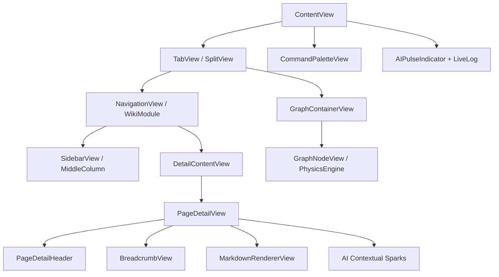

# Knowledge Management 视觉设计系统 (Design System)

## 1. 设计原则 (Principles)
*   **深邃感**：采用暗色调背景与半透明材质（Material），营造专注、理性的阅读氛围。
*   **确定性**：所有的异步 AI 状态必须有视觉脉搏（Pulse）或触感反馈（Haptic）。
*   **语义化**：色彩不仅仅是装饰，更是状态的传递（如：紫色代表 AI，绿色代表激活）。

## 2. 色彩系统 (Color Palette)

| 名称 | 十六进制/语义 | 用途 |
| :--- | :--- | :--- |
| **WikiAccent** | `#8E44AD` (Purple) | AI 指示、核心品牌色、高亮链接。 |
| **WikiBackground**| `#121212` | 主容器背景。 |
| **WikiCard** | `#1E1E1E` (w/ Blur) | 卡片容器、悬浮窗口。 |
| **WikiSuccess** | `#2ECC71` (Green) | 健康检查通过、保存成功。 |
| **WikiWarning** | `#F1C40F` (Yellow) | 孤岛页面、断链提示。 |

## 3. 字体规范 (Typography)
*   **标题**：SF Pro Display, Bold (用于页面标题与 Dashboard 度量)。
*   **正文**：SF Pro Rounded, Regular (用于普通文本，增加亲和感)。
*   **代码/单字**：SF Mono (用于标签与技术参数)。

## 4. 交互反馈 (Interaction)
*   **触感等级**：
    *   `Light`: 普通点击、选中切换。
    *   `Medium`: 链接建立、侧边栏展开。
    *   `Heavy`: 金库锁定、AI 任务失败。
*   **动效标准**：使用 `Spring(response: 0.3, dampingFraction: 0.7)` 作为全局标准动效，确保流畅度与响应感。

## 5. 核心组件规范 (Component Standards)

### 5.1 空间导航面包屑 (Breadcrumbs)
- **视觉**: 使用 `ultraThinMaterial` 背景，文字采用 `caption` 字号。
- **状态**: 当前路径高亮为 `WikiAccent`，历史路径弱化为 `wikiSecondary`。
- **价值**: 消除深度跳转后的心理焦虑，提供物理级回溯感。

### 5.2 AI 知识芯片 (AI Knowledge Chips)
- **视觉**: 圆角胶囊 (Capsule)，背景色 `WikiAccent.opacity(0.15)`，带 1px 描边。
- **交互**: 具备 Hover 缩放效果，点击触发精准页面跳转。
- **价值**: 将文本回复转化为可操作的原子化知识块。

### 5.3 实时日志流 (Live Logs)
- **视觉**: 在脉搏指示器下方显示的微缩文本，使用 `monospaced` 字体。
- **动效**: 采用 `push(from: .bottom)` 的进场方式。
- **价值**: 实现“透明处理”，通过实时输出任务细节降低用户的感知延迟。

## 6. 视图组件拓扑 (Component Topology)

