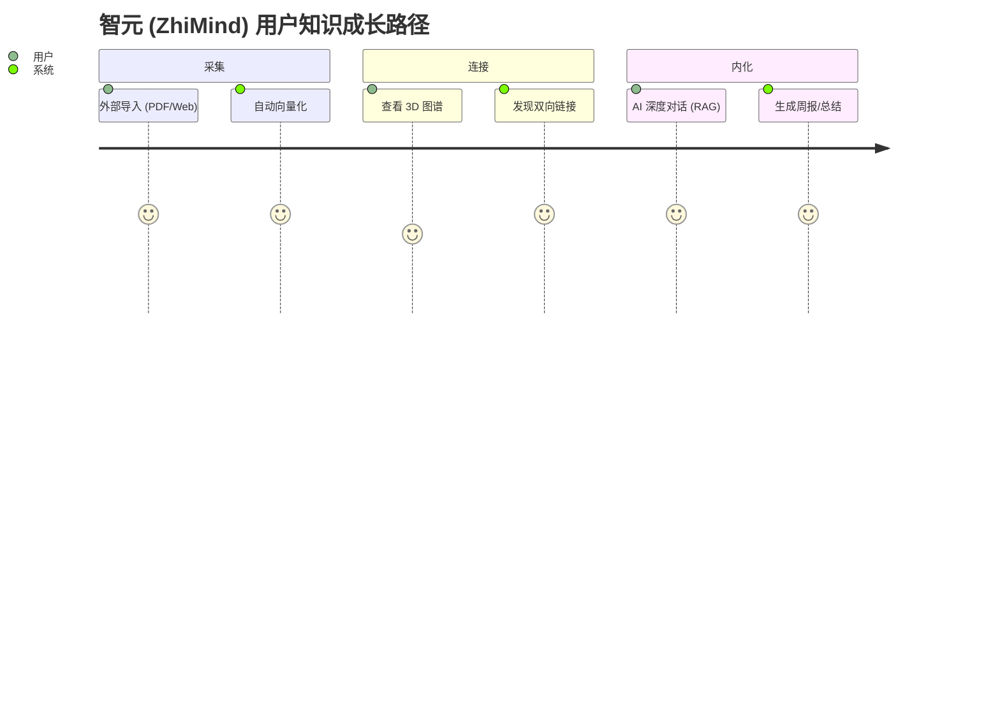
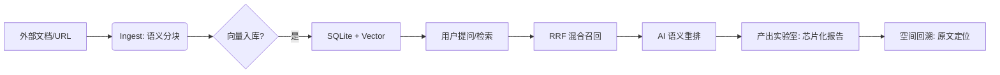

# Knowledge Management 产品需求文档 (PRD)

## 1. 产品愿景
打造一个“懂你”的跨端知识操作系统，通过 AI 深度感知与插件化生态，解决知识“存而不用”的痛点。

## 2. 目标用户 (User Personas)
*   **科研/学生**：需要处理海量文献，追求深度链接与 RAG 检索。
*   **开发者/产品经理**：追求键盘优先体验 (Cmd+K)，需要高度的可定制化（插件）。

## 3. 核心功能规格 (MVP+)
### 3.1 AI 深度探索 (AI Deep Research)
*   **正常流程**：用户输入问题 -> 系统提取本地 Context -> 触发 RAG -> 渲染芯片化链接。
*   **异常处理**：若无本地匹配，系统应提示“知识盲区”，并建议联网搜索。

### 3.2 插件化拦截系统
*   **业务逻辑**：插件必须在数据入库 `SQLite` 前完成 `preProcess`，确保全文搜索 (FTS5) 索引的是处理后的干净数据。

## 4. 非功能性需求 (Non-Functional Requirements)
*   **性能**：本地搜索响应延迟 < 200ms；AI 混合检索首字弹出 < 1s。
*   **隐私**：默认“离线优先”，敏感内容向量化必须在 Apple Neural Engine 内部完成。

## 4. 用户路径地图 (User Journey Map)

通过典型的“碎片化采集到知识内化”路径，展示系统的核心价值点。

## 5. 异常流程定义 (Exception Flows)

| 异常场景 | 系统行为 | 用户反馈/引导 |
| :--- | :--- | :--- |
| **网络中断** | 自动切换为“纯本地检索”模式。 | 顶部状态栏显示“离线模式”，AI 按钮置灰。 |
| **向量化失败** | 将页面标记为“待索引”，并在后台空闲时重试。 | 详情页 Badge 显示“AI 准备中”，不影响正常编辑。 |
| **插件权限冲突** | 拦截非法请求，并对插件执行“熔断”降级。 | 弹出 Toast 提示“插件 X 已因越权操作被停用”。 |
| **存储空间不足** | 优先保证数据库记录，延迟或压缩缓存。 | 弹出系统警告，建议清理过期的导出快照。 |

---

## 6. 用户引导策略 (Onboarding)
*   **初次启动**：自动挂载“欢迎金库 (Welcome Vault)”，通过一篇交互式 Markdown 文档引导用户体验双向链接与 AI 总结。
*   **功能引导**：在用户首次进入“插件中心”或“3D 图谱”时，弹出轻量级的蒙层指引，降低认知门槛。

## 7. 安全与隐私增强 (Security & Privacy+)
*   **金库锁定 (Vault Locking)**：支持通过系统原生生物识别 (FaceID/TouchID/密码) 对单个金库进行物理加锁。
*   **隐私模式切换**：支持“隐藏敏感文件夹”，在预览模式下自动对标记为 #private 的内容执行高斯模糊处理。

## 8. 反馈与生态治理 (Governance)
*   **反馈闭环**：在设置页提供“一键导出匿名诊断包”，方便用户在遇到性能瓶颈或插件崩溃时，将上下文回传给核心开发组。

## 9. 验收标准 (Acceptance Criteria)
*   [ ] 跨端适配：iPad 分屏模式下 UI 不错位。
*   [ ] 插件隔离：非法插件崩溃不影响主程序运行。
# 智元 (ZhiMind) 全量特性与技术规格清单

## 1. 核心 AI 特性 (AI Core)
*   **多模型适配 (Adapter Pattern)**: 完美支持 OpenAI, DeepSeek, SiliconFlow 及本地 Ollama 引擎。
*   **智能编译 (Smart Ingest)**: 自动提取标签、摘要并重构 Markdown 内容。
*   **混合检索 (Hybrid RAG)**: 结合向量检索与关键词 RRF 算法，确保知识点精准召回。
*   **离线处理队列 (Ingest Queue)**: 后台异步处理大规模文档导入，不阻塞 UI。

## 2. 知识可视化 (Visualization)
*   **3D 动力学图谱**: 支持数万级节点的流畅渲染与物理布局。
*   **LOD 渲染优化**: 根据缩放级别自动调整节点细节，极致性能。
*   **语义聚类视图**: 自动将关联页面聚合为“领域星云”。

## 3. 跨端深度集成 (Platform Integration)
*   **iOS/iPadOS**: 
    *   实时活动 (Live Activity) 监控 AI 进度。
    *   Apple Pencil 双击切换工具。
    *   Siri Shortcuts 快速记录。
*   **macOS**:
    *   Spotlight 全局系统搜索集成。
*   **watchOS (KMWatch)**:
    *   抬腕即记：支持系统级语音转文字采集。
    *   表盘秒开：通过 Complications 一键触发采集流程。
    *   离线同步：通过 WCSession 实现跨端无感数据对齐。

## 4. 安全与隐私 (Security)
*   **生物识别金库**: 支持 FaceID/TouchID 二次鉴权。
*   **隐私模式**: 支持一键模糊敏感内容。
*   **纯本地优先**: 数据存储于本地 SQLite，无强制云端同步。

## 5. 软件规格 (Specifications)
*   **存储引擎**: SQLite 3.35.0+。
*   **向量引擎**: 基于 Accelerate 框架的余弦相似度计算。
*   **UI 框架**: SwiftUI (100% 原生)。
*   **最低支持**: iOS 16.0+, macOS 13.0+。
# Knowledge Management 功能清单 & 测试指南

> 文档版本：2026-05-01 (v2.1) | 覆盖全平台特性、组件与 AI 诊断逻辑

---

## 一、AI 大模型核心 (LLM Core)

### 1.1 大模型配置 (Model Settings)
- [x] **多服务商支持**：OpenAI / DeepSeek / 硅基流动 / 自定义。
- [x] **连通性测试 (Test)**：显示 `连通正常` 或 `连通异常`。
- [x] **延迟监测 (Latency)**：实时计算 API 往返耗时 (ms)。
- [x] **精准排障**：失败时展示 HTTP 错误码（如 401, 429）及服务器原始错误原因。
- [x] **本地大模型 (Local Model)**：支持 CoreML 模型加载、卸载及推理速度 (tok/s) 监测。

### 1.2 知识编译与进化 (Knowledge Evolution)
- [x] **智能编译 (Smart Ingest)**：原始文本 -> 结构化 Wiki (包含摘要、标签、关联页面建议)。
- [x] **增量折叠 (Smart Folding)**：自动识别现有页面内容，将新信息融合进旧页面，防止内容碎片化。
- [x] **URL 智能摄入**：集成 Jina Reader 自动去广告去干扰，保留纯净 Markdown。
- [x] **知识溯源 (Provenance)**：在页面底部自动生成 `Sources` 区域，保留原始链接与引用片段。

---

## 二、知识管理与维护 (Wiki & Maintenance)

### 2.1 页面详情 (Page Detail)
- [x] **现代视觉**：详情页顶部采用毛玻璃 (Material) 背景，支持沉浸式阅读。
- [x] **AI 快捷操作**：
    - **一键摘要**：提取当前页面核心观点。
    - **生成存根 (Stubs)**：为关联但不存在的页面一键生成草稿。
    - **修复建议**：针对 Lint 发现的问题进行 AI 自动修复。
- [x] **多维元数据**：别名 (Aliases)、标签、类型、状态、可信度、出/入链统计。

### 2.2 维护中心 (Health Check)
- [x] **全量扫描 (Lint)**：检测断链、孤岛页面、循环引用、占位页面。
- [x] **操作日志 (Activity)**：记录创建、更新、删除、编译等所有关键行为。
- [x] **趋势可视化**：欢迎页展示 30 天内知识总量的增长趋势曲线。

---

## 三、导入与采集 (Ingest & Collection)

### 3.1 导入流水线 (Activity Pipeline)
- [x] **异步任务显示**：在导入页下方显示实时任务列表。
- [x] **状态反馈**：待处理、处理中（带旋转动画）、已完成（带“查看”跳转）、失败。
- [x] **多渠道入口**：
    - **文件导入**：PDF/TXT/Markdown 批量解析。
    - **OCR 扫描**：Vision 框架高精度文字识别。
    - **语音笔记**：10+ 语言实时转写。
    - **剪贴板导入**：智能识别内容并预填充表单。

---

## 四、数据与同步 (Data & Sync)

- [x] **iCloud 同步**：支持冲突检测策略（保留本地/远程/合并）。
- [x] **物理对齐**：导出全库为本地 Markdown 文件系统。
- [x] **SQLite FTS5**：毫秒级全文检索，支持 CJK 分词增强。
- [x] **自动备份**：多版本快照保护，防数据丢失。

---

## 五、测试要点 (Test Guide)

### 5.1 连通性测试
1. 进入 `设置 -> 大模型设置`。
2. 输入错误的 API Key，观察是否正确显示 `401` 或 `Unauthorized`。
3. 输入正确的 Key，观察延迟信息是否正常显示。

### 5.2 URL 摄入
1. 在 `导入 -> URL 导入` 中输入一个包含大量广告的网页链接（如新闻站点）。
2. 在导入任务列表中点击“查看”，验证内容是否已自动去除干扰并转为 Markdown。

### 5.3 智能折叠 (Smart Folding)
1. 准备一个已存在的“苹果”页面。
2. 导入一段关于“苹果新品发布会”的新文本，并选择“开启智能折叠”。
3. 验证新信息是否被融合进原页面，而不是覆盖原页面。

---
*文档更新时间：2026-05-01 | 品牌化与大模型诊断逻辑全量同步*
# Knowledge Management 产品规格说明书 (PRD/SRS)

## 1. 产品愿景 (Vision)
构建一个“AI 原生”的个人知识进化引擎。不同于传统的笔记应用，Knowledge Management 的核心价值在于 **“将离散的资料转化为连动的智慧”**，通过 Karpathy Wiki 方法论实现知识的深度摄入、智能关联与主动召回。

## 2. 用户旅程 (User Journey Map)

### 阶段一：初识 (First Contact)
*   **动作**：用户拖入首批 PDF，看到 AI Pulse 开始闪烁。
*   **感受**：好奇、受期待。
*   **目标**：成功完成首次 Ingest，看到拓扑图雏形。

### 阶段二：建立联系 (Linking)
*   **动作**：用户在编辑时使用 `[[` 语法，或接受 AI 的 Link 建议。
*   **感受**：掌控感、发现的快乐。
*   **目标**：形成第一个知识群落（Cluster）。

### 阶段三：主动反馈 (Active Usage)
*   **动作**：用户查看 Dashboard 增长趋势，阅读 Weekly Insight。
*   **感受**：产出感、成就感。
*   **目标**：养成每日查看 Daily Recap 的习惯。

### 阶段四：知识进化 (Evolution)
*   **动作**：通过智能折叠将零散资料合并，金库规模突破 1000 节点。
*   **感受**：由于知识有序化带来的思维清澈。
*   **目标**：Knowledge Management 成为其“第二大脑”。

## 3. 核心用户故事 (User Stories)
*   **作为研究员**：我希望拖入 50 份 PDF 后，AI 能自动提取实体并建立双向链接，以便我发现跨领域的潜在联系。
*   **作为学生**：我希望在早起时收到“每日闪念”，重温一个月前记下的难点，防止遗忘。
*   **作为隐私极客**：我希望我的知识库完全存储在本地，并支持生物识别加锁，确保 AI 不会泄露我的隐私。
*   **作为移动办公者**：我希望在灵感爆发时，能通过 Apple Watch 抬手即记，内容自动同步并被 iPhone 端的 AI 向量化。

## 3. 功能特性列表 (Feature Matrix)

| 模块 | 功能 | 优先级 | 规格说明 |
| :--- | :--- | :--- | :--- |
| **摄入层** | 50MB 多模态导入 | P0 | 支持 PDF, Docx, MD, Xlsx；自动执行语义分块。 |
| **存储层** | 混合 RAG 存储 | P0 | FTS5 全文搜索 + 本地向量相似度索引。 |
| **安全层** | 金库级锁定 | P1 | 基于 FaceID/TouchID 的 LAContext 验证；App 切换自动上锁。 |
| **交互层** | AIPulseIndicator | P1 | 实时展示 AI 思考与扫描状态。 |
| **见解层** | 智能召回 (Recap) | P2 | 基于时间加权的随机采样算法 + LLM 语义重联。 |
| **适配层** | 响应式跨端架构 | P0 | 自适应 NavigationSplitView，全面适配 iPhone/iPad/Mac。 |
| **采集层** | KMWatch 腕上终端 | P1 | 支持 Apple Watch 语音记录、表盘组件与 WCSession 实时同步。 |
| **交互层** | 键盘优先交互 | P1 | 全局 Cmd+K 指令中枢，支持模糊指令与快速跳转。 |
| **导航层** | 空间感知面包屑 | P2 | 记录跳转路径，支持一键回溯，解决深度链接迷失感。 |
| **生态层** | 知识库分发市场 | P3 | **[前瞻]** 支持专家级知识金库 (Vault) 的发布与一键导入，实现知识体系的商业化分发。 |

## 4. 业务规则与约束
*   **隐私约束**：所有向量化与搜索必须在端侧（或用户授权的 API）完成，严禁上传用户原始文档。
*   **性能约束**：混合检索全链路耗时不得超过 1.5 秒。
*   **工程约束**：核心 Service 必须遵循 Actor 模型，确保并发安全。

## 5. 竞品差异化分析 (Competitive Analysis)

| 维度 | Obsidian (Smart Connections) | Notion AI | **Knowledge Management** |
| :--- | :--- | :--- | :--- |
| **数据隐私** | 本地，但配置复杂。 | 云端，存在隐私忧虑。 | **完全本地，金库级锁。** |
| **感知体验** | 静态，无任务感知。 | 只有简单的加载条。 | **动态 AI 脉搏 + 实时日志。** |
| **交互深度** | 纯文本链接。 | 卡片化但不可定制。 | **交互知识芯片 + 空间面包屑。** |
| **跨端能力** | 移动端性能一般。 | 网页/App 体验一致。 | **自适应三栏架构 (iPad/Mac)。** |

## 6. 核心业务流程图 (Core User Flow)

