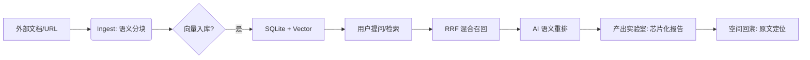

# Knowledge Management 产品规格说明书 (PRD/SRS)

## 1. 产品愿景 (Vision)
构建一个“AI 原生”的个人知识进化引擎。不同于传统的笔记应用，Knowledge Management 的核心价值在于 **“将离散的资料转化为连动的智慧”**，通过 Karpathy Wiki 方法论实现知识的深度摄入、智能关联与主动召回。

## 2. 用户旅程 (User Journey Map)

### 阶段一：初识 (First Contact)
*   **动作**：用户拖入首批 PDF，看到 AI Pulse 开始闪烁。
*   **感受**：好奇、受期待。
*   **目标**：成功完成首次 Ingest，看到拓扑图雏形。

### 阶段二：建立联系 (Linking)
*   **动作**：用户在编辑时使用 `[[` 语法，或接受 AI 的 Link 建议。
*   **感受**：掌控感、发现的快乐。
*   **目标**：形成第一个知识群落（Cluster）。

### 阶段三：主动反馈 (Active Usage)
*   **动作**：用户查看 Dashboard 增长趋势，阅读 Weekly Insight。
*   **感受**：产出感、成就感。
*   **目标**：养成每日查看 Daily Recap 的习惯。

### 阶段四：知识进化 (Evolution)
*   **动作**：通过智能折叠将零散资料合并，金库规模突破 1000 节点。
*   **感受**：由于知识有序化带来的思维清澈。
*   **目标**：Knowledge Management 成为其“第二大脑”。

## 3. 核心用户故事 (User Stories)
*   **作为研究员**：我希望拖入 50 份 PDF 后，AI 能自动提取实体并建立双向链接，以便我发现跨领域的潜在联系。
*   **作为学生**：我希望在早起时收到“每日闪念”，重温一个月前记下的难点，防止遗忘。
*   **作为隐私极客**：我希望我的知识库完全存储在本地，并支持生物识别加锁，确保 AI 不会泄露我的隐私。

## 3. 功能特性列表 (Feature Matrix)

| 模块 | 功能 | 优先级 | 规格说明 |
| :--- | :--- | :--- | :--- |
| **摄入层** | 50MB 多模态导入 | P0 | 支持 PDF, Docx, MD, Xlsx；自动执行语义分块。 |
| **存储层** | 混合 RAG 存储 | P0 | FTS5 全文搜索 + 本地向量相似度索引。 |
| **安全层** | 金库级锁定 | P1 | 基于 FaceID/TouchID 的 LAContext 验证；App 切换自动上锁。 |
| **交互层** | AIPulseIndicator | P1 | 实时展示 AI 思考与扫描状态。 |
| **见解层** | 智能召回 (Recap) | P2 | 基于时间加权的随机采样算法 + LLM 语义重联。 |
| **适配层** | 响应式跨端架构 | P0 | 自适应 NavigationSplitView，全面适配 iPhone/iPad/Mac。 |
| **交互层** | 键盘优先交互 | P1 | 全局 Cmd+K 指令中枢，支持模糊指令与快速跳转。 |
| **导航层** | 空间感知面包屑 | P2 | 记录跳转路径，支持一键回溯，解决深度链接迷失感。 |
| **生态层** | 知识库分发市场 | P3 | **[前瞻]** 支持专家级知识金库 (Vault) 的发布与一键导入，实现知识体系的商业化分发。 |

## 4. 业务规则与约束
*   **隐私约束**：所有向量化与搜索必须在端侧（或用户授权的 API）完成，严禁上传用户原始文档。
*   **性能约束**：混合检索全链路耗时不得超过 1.5 秒。
*   **工程约束**：核心 Service 必须遵循 Actor 模型，确保并发安全。

## 5. 竞品差异化分析 (Competitive Analysis)

| 维度 | Obsidian (Smart Connections) | Notion AI | **Knowledge Management** |
| :--- | :--- | :--- | :--- |
| **数据隐私** | 本地，但配置复杂。 | 云端，存在隐私忧虑。 | **完全本地，金库级锁。** |
| **感知体验** | 静态，无任务感知。 | 只有简单的加载条。 | **动态 AI 脉搏 + 实时日志。** |
| **交互深度** | 纯文本链接。 | 卡片化但不可定制。 | **交互知识芯片 + 空间面包屑。** |
| **跨端能力** | 移动端性能一般。 | 网页/App 体验一致。 | **自适应三栏架构 (iPad/Mac)。** |

## 6. 核心业务流程图 (Core User Flow)

